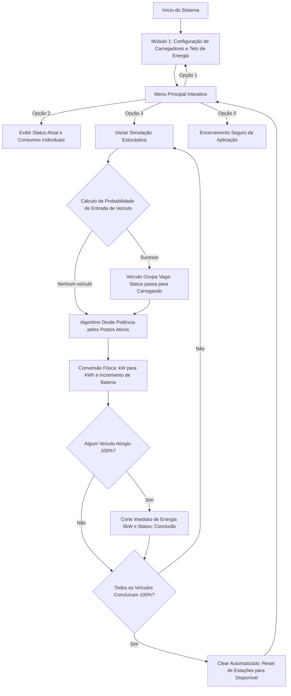

# ChargeGrid Intelligence — Linha HCA G2 (GoodWe) ⚡🚗

O ChargeGrid Intelligence é uma Prova de Conceito (PoC) desenvolvida em Python para o gerenciamento inteligente, automatizado e dinâmico de eletropostos comerciais. O projeto é fruto de um desafio prático corporativo (Challenge) em parceria com a multinacional **GoodWe**, focado na transposição de sua infraestrutura de carregadores elétricos residenciais (Linha HCA G2 — modelos GW7K, GW11K e GW22K-HCA-20) para cenários de alta demanda, como o estacionamento de shoppings centers.

---

## 📖 Introdução e Contextualização do Projeto

Após a conclusão da Sprint 1, na qual desenvolvemos uma base sólida para a contextualização do Challenge da multinacional GoodWe — empresa parceira deste projeto e consolidada no setor de energia solar — na parte de infraestrutura de carregamento de veículos elétricos, este relatório marca a transição da teoria para a prática. 

Retomando o projeto passado, o estudo focava na linha HCA G2 para o ecossistema ChargeGrid Intelligence, uma solução de carregadores de alta tecnologia apresentada como desafio prático para os alunos. Diante do cenário de eletrificação global e da crescente demanda por mobilidade sustentável e elétrica dos novos veículos, a migração do ambiente residencial — onde os modelos GW7K, GW11K e GW22K-HCA-20 operam com conectividade Wi-Fi, Bluetooth e RFID (Identificação por Radiofrequência) — para o cenário comercial trouxe desafios técnicos e operacionais de alta complexidade. Ao estruturar os quatro pilares do projeto — Controle de demanda, protocolos abertos, tarifação e inteligência artificial —, superamos os desafios propostos com soluções inovadoras, cujo foco principal foi garantir uma jornada de recarga intuitiva e uma excelente experiência para o usuário.

Enquanto a etapa principal cumpriu o papel de mapear o cenário dos eletropostos comerciais, direcionar o foco para o mundo das recargas elétricas e identificar as limitações operacionais da infraestrutura de recarga, a presente pesquisa para a Sprint 2 tem como propósito materializar essas soluções. Considerando que a execução física do projeto demandaria tempo e recursos materiais complexos para a etapa atual de desenvolvimento, optou-se pela validação lógica. Através do desenvolvimento de uma Prova de Conceito (PoC) em Python, o projeto ChargeGrid Intelligence deixa de ser apenas um modelo conceptual e passa a estruturar-se como um sistema automatizado e funcional.

---

## 🎯 Descrição da Solução

Esta etapa atual marca a transição definitiva entre o planejamento conceitual e a execução técnica. O sistema apresenta uma interface de terminal robusta e intuitiva, operando por meio de um menu interativo estruturado em um menu composto por quatro opções principais de navegação:

* **1. Configuração de Parâmetros:** Módulo responsável pela gestão energética e disponibilização de carregadores, permitindo ao administrador monitorar o limite energético disponível no estabelecimento e reconfigurar dinamicamente a quantidade de carregadores.
* **2. Visualização de Status:** Painel de monitoramento projetado para exibir o diagnóstico atual do sistema, detalhando a disponibilidade dos carregadores e a potência real fornecida pelo estabelecimento.
* **3. Executar Recarga (Simulação):** O núcleo prático do software, responsável por simular o comportamento prático e real dos veículos elétricos sob estímulos de uso do ambiente comercial, testando a eficiência do algoritmo sob demanda.
* **4. Sair:** Função de encerramento seguro, responsável por finalizar o loop da aplicação e liberar os recursos do sistema.

---

## 🧮 Fundamentação Matemática e Lógica

### 1. Densidade de Tráfego Probabilística
Em vez de usar tempos fixos e engessados de entrada para os veículos, a simulação utiliza um modelo de sorteio estatístico que calcula a probabilidade $p$ de um veículo estacionar a cada minuto da simulação, baseado diretamente na capacidade instalada:

$$p = \min(0.05 \times \text{nº de carregadores}, 0.75)$$

Isso garante que, organicamente, estabelecimentos comerciais com maior número de postos gerem uma taxa maior de atratividade de fluxo na simulação.

### 2. Conversão Física de Energia ($\text{kW}$ para $\text{kWh}$)
A velocidade de carregamento é modelada estritamente através da física automotiva, adotando uma capacidade nominal padrão de bateria de $50.0\text{ kWh}$. A cada loop incremental (que simula o intervalo de 1 minuto decorrido), a energia exata integrada é gerada a partir da equação:

$$\text{Energia Entregue (kWh)} = \text{Consumo Atual (kW)} \times \left(\frac{1}{60}\right)$$

O resultado é convertido no incremento percentual real na bateria, simulando flutuações de velocidade sempre que um novo veículo entra ou sai da rede.

---

## 💻 Instruções de Uso e Execução

### Pré-requisitos
* Ter o Python 3.10 ou superior instalado em sua máquina.
* Não há necessidade de instalar bibliotecas de terceiros (o sistema opera puramente utilizando módulos nativos como `time` e `random`).

### Execução da Aplicação

1. Clone este repositório em sua máquina local:
   ```bash
   git clone [https://github.com/seu-usuario/chargegrid-intelligence.git](https://github.com/seu-usuario/chargegrid-intelligence.git)

2. Navegue até a pasta do projeto:
    ```bash
    cd chargegrid-intelligence

3. Execute o script principal:
    ```bash
    python main.py

---

## Navegando no Sistema

Ao iniciar o programa pelo console, utilize os comandos do menu interativo:

1 - Configurar Parâmetros: Define o número de pontos físicos disponíveis no estabelecimento (de 1 a 999) e o teto máximo elétrico local do estabelecimento (em kW).

2 - Visualizar Status: Exibe um relatório diagnóstico em tabela de toda a matriz de carregadores, os percentuais de bateria atuais e o consumo total em tempo real da rede.

3 - Executar Recarga: Inicia o motor gráfico de simulação minuto a minuto, exibindo os rebalanceamentos automáticos de potência na tela.

0 - Sair: Finaliza o loop operacional do software de forma limpa.

---

## 🔄 Arquitetura e Fluxo do Sistema

O fluxo operacional lógico do software simula de ponta a ponta o ciclo de vida do carregamento comercial:


